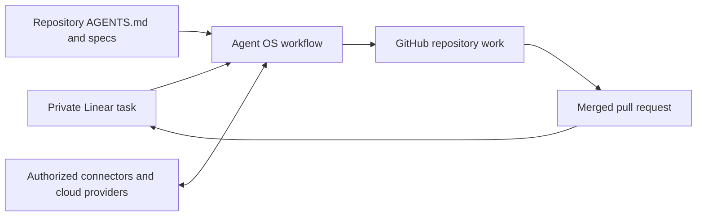

# Agent OS architecture

Agent OS is a private control-plane plugin for rebuilding a consistent development workflow in replaceable Codex environments. It stores reusable method and orchestration while durable external systems store project facts and execution state.

## System boundaries

| Concern | Source of truth |
| --- | --- |
| Cross-project method, privacy, and authority | Agent OS plugin |
| Private task, decisions, blockers, and completion evidence | Linear |
| Code, specifications, repository rules, commits, and pull requests | GitHub repository |
| Authorized external actions | Connector, MCP, or provider CLI |
| Runtime data, deployment, and secrets | Cloud provider |
| Temporary editing and verification | Codex environment |



The return edge writes the merged pull-request link and observed evidence to Linear. No edge writes private Linear task metadata to GitHub.

## Delivery lifecycle

1. Start from a Linear issue.
2. Resolve the linked GitHub repository and reuse or create the privacy-safe GitHub issue required for non-trivial work.
3. Load repository-local instructions, specifications, tests, and smoke paths.
4. Create an issue-scoped GitHub branch without private task metadata.
5. Implement Red-Green-Refactor-Verify slices.
6. Review, commit, push, and open a GitHub pull request with scope-first naming.
7. Wait for required checks and merge authority.
8. After merge, when the repository has an established staging environment, the change affects its runtime, and the repository workflow pre-authorizes staging deployment, deploy with the enabled path and run the smallest representative smoke. Otherwise request approval only when staging validation is actually required; add a gate only for a concrete recorded risk.
9. Record the merge and any applicable staging evidence without inferring production exposure, then write the pull request, commit, verification, risk, and follow-up to Linear. Do not block completion on unrelated or optional staging proof.
10. Mark the Linear issue complete after durable merge evidence and the task's required acceptance checks are saved.

## Recovery protocol

A fresh environment resumes from the Linear issue, then follows its GitHub links to the pull request, remote branch, and repository. Remote Git state overrides stale checkpoints. Uncommitted local work and previous chat history are disposable and must not be required for recovery.

## Repository shape

```text
.agents/plugins/marketplace.json                  Repository marketplace
plugins/agent-os/.codex-plugin/plugin.json        Installable plugin manifest
plugins/agent-os/skills/execute-linear-issue/     End-to-end orchestration skill
  agents/openai.yaml                              Skill discovery metadata
  references/authority-policy.md                  Approval and safety boundary
  references/completion-checkpoint.md             Post-merge Linear evidence
  references/database-change.md                   Conditional compatibility policy
  references/engineering-quality.md               TDD, abstraction, and review policy
  references/github-privacy.md                    One-way privacy contract
  references/implementation-lifecycle.md          GitHub delivery protocol
  references/issue-contract.md                    Scope authority and projection
  references/living-map.md                        Code and documentation synchronization
  references/release-safety.md                    Fast staging and production exposure
scripts/verify_architecture.py                    Deterministic architecture checks
```

Provider-specific skills, custom MCP servers, apps, hooks, and automations are intentionally absent. Add them only after a concrete repeated use case establishes their contract and verification path.

## Installation model

The private Git repository is the distribution source. Add it as a Codex plugin marketplace, install `agent-os`, authorize the required external systems separately, and open a new task so the installed skill metadata is loaded.

OAuth sessions, tokens, cloud secrets, project code, and project-specific domain knowledge never ship inside the plugin.
