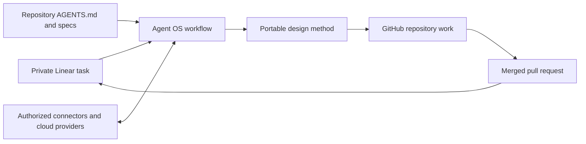

# Agent OS architecture

Agent OS is a private control-plane plugin for rebuilding a consistent development workflow in replaceable Codex environments. It stores reusable method and orchestration while durable external systems store project facts and execution state.

## System boundaries

| Concern | Source of truth |
| --- | --- |
| Cross-project delivery and design method, privacy, and authority | Agent OS plugin |
| Private task, decisions, blockers, and completion evidence | Linear |
| Code, domain language, business rules, schemas, API contracts, specifications, repository rules, commits, and pull requests | GitHub repository |
| Authorized external actions | Connector, MCP, or provider CLI |
| Runtime data, deployment, and secrets | Cloud provider |
| Temporary editing and verification | Codex environment |



The return edge writes the merged pull-request link and observed evidence to Linear. No edge writes private Linear task metadata to GitHub.

## Delivery lifecycle

1. Start from a Linear issue.
2. Resolve the linked GitHub repository and reuse or create the privacy-safe GitHub issue required for non-trivial work.
3. Prepare the development workspace by recovering durable remote state, reading repository-local instructions and declarations, protecting secret and environment boundaries, discovering required capabilities, and producing an ephemeral Workspace Readiness result.
4. Create an issue-scoped GitHub branch without private task metadata.
5. Apply portable design judgment when the change affects domain language, invariants, boundaries, persistence, interfaces, or architecture; write every concrete decision back to the repository branch.
6. Implement Red-Green-Refactor-Verify slices, selecting the smallest sufficient evidence from targeted static checks through affected-module, integration, full-suite, or staging validation as demonstrated risk grows.
7. At coherent phase boundaries or before interruption risk, form a reviewable or recoverable-only checkpoint; never present inconsistent local state as delivered.
8. Review, commit, push, and open a GitHub pull request with scope-first naming.
9. Wait for required checks and merge authority.
10. After merge, when the repository has an established staging environment, the change affects its runtime, and the repository workflow pre-authorizes staging deployment, deploy with the enabled path and run the smallest representative smoke. Otherwise request approval only when staging validation is actually required; add a gate only for a concrete recorded risk.
11. Record the merge and any applicable staging evidence without inferring production exposure, then write the pull request, commit, verification, risk, and follow-up to Linear. Do not block completion on unrelated or optional staging proof.
12. Mark the Linear issue complete after durable merge evidence and the task's required acceptance checks are saved.

## Sidecar bootstrap

Agent OS activation is external to target repositories. `scripts/agent-os.mjs` copies validated Skills into the user-level Codex Skill directory, stores locks and handoffs under `AGENT_OS_HOME`, and compares target HEAD, branch, index, worktree status, local Git configuration, and hooks before and after activation. Bootstrap fails on any target mutation. It never adds project files, configuration, hooks, submodules, ignore rules, or state.

The deterministic CLI cannot invoke ChatGPT connectors. Its handoff is an ephemeral locator consumed in a new task by `prepare-development-workspace`, which independently verifies GitHub, Linear, and other durable state. The handoff is never project truth.

## Recovery protocol

A fresh environment resumes from the Linear issue, then follows its GitHub links to the pull request, remote branch, and repository. The workspace preparation Skill classifies required runtimes, commands, tools, services, and authorization as available, unavailable, requires authorization, or unknown, then names the safe recovery entry point. Remote Git state overrides stale checkpoints. Uncommitted local work, readiness reports, and previous chat history are disposable and must not be required for recovery.

## Repository shape

```text
.agents/plugins/marketplace.json                  Repository marketplace
plugins/agent-os/.codex-plugin/plugin.json        Installable plugin manifest
plugins/agent-os/skills/execute-linear-issue/     End-to-end orchestration skill
  agents/openai.yaml                              Skill discovery metadata
  references/authority-policy.md                  Approval and safety boundary
  references/completion-checkpoint.md             Post-merge Linear evidence
  references/database-change.md                   Conditional compatibility policy
  references/engineering-quality.md               TDD, abstraction, and review policy
  references/github-privacy.md                    One-way privacy contract
  references/implementation-lifecycle.md          GitHub delivery protocol
  references/issue-contract.md                    Scope authority and projection
  references/living-map.md                        Code and documentation synchronization
  references/release-safety.md                    Fast staging and production exposure
  references/verification-strategy.md             Risk-scaled verification ladder
plugins/agent-os/skills/design-software-change/   Cross-project software design skill
  agents/openai.yaml                              Skill discovery metadata
  references/design-precedence.md                 Plugin method and project-truth boundary
  references/deep-modules.md                      Module depth and complexity containment
  references/naming-and-types.md                   Semantic naming and type guidance
  references/domain-modeling.md                    Domain language, invariants, and ownership
  references/database-design.md                    Durable data-model design
  references/api-design.md                         Callable-boundary and contract design
plugins/agent-os/skills/prepare-development-workspace/ Evidence-based workspace readiness skill
  agents/openai.yaml                              Skill discovery metadata
  references/capability-discovery.md              Runtime, command, tool, and service evidence
  references/workspace-readiness.md               Concise readiness result contract
  references/workspace-security.md                VM secret, logging, and credential isolation
plugins/agent-os/skills/checkpoint-development-work/ Coherent checkpoint skill
  agents/openai.yaml                              Skill discovery metadata
  references/checkpoint-consistency.md            Reviewable and recoverable state rules
  references/checkpoint-record.md                 Durable pause and resume evidence
scripts/agent-os.mjs                              External bootstrap, doctor, status, and uninstall CLI
scripts/test_bootstrap.mjs                         Deterministic zero-pollution and lifecycle checks
scripts/verify_privacy.py                          Private metadata and credential-artifact scan
docs/bootstrap.md                                  Sidecar bootstrap usage and trust boundary
docs/manual-acceptance.md                         Human-run workflow acceptance checklist
```

Provider-specific skills, custom MCP servers, apps, hooks, and automations are intentionally absent. Add them only after a concrete repeated use case establishes their contract and verification path.

## Installation model

The private Git repository is the distribution source. Users may install the Plugin through its marketplace or run the Sidecar bootstrap to activate user-level Skills without touching a target project. External systems are authorized separately, and a new task is required after Skill activation so discovery runs again.

OAuth sessions, tokens, cloud secrets, project code, and project-specific domain knowledge never ship inside the plugin. The plugin carries reusable design questions and decision criteria; target repositories carry the answers.

## Acceptance boundary

Official Skill and Plugin validators own package-format validation. GitGuardian owns secret detection. The repository adds one fast privacy scan for private task metadata and obvious credential artifacts, plus a one-page manual checklist for workspace recovery, checkpoints, privacy, authority, staging, and design precedence.

Agent behavior automation is intentionally deferred. Add a focused regression only after the same failure pattern appears in at least three real project uses or when a target repository already requires it; do not build a general LLM benchmark or make nested Agent execution a normal release gate.
