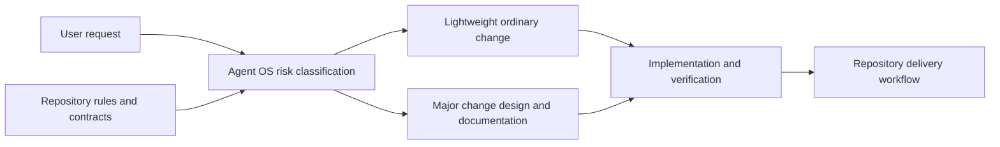

# Agent OS architecture

Agent OS is a personal control-plane plugin for applying proportionate software-development workflows in replaceable Codex environments. It stores reusable method; target repositories store project truth and implementation history.

## System boundaries

| Concern | Source of truth |
| --- | --- |
| Cross-project delivery, design, privacy, authority, and verification method | Agent OS plugin |
| Project intent, boundary contracts, architecture, and decisions | Target repository documentation |
| Requested scope | Current user instruction and any repository-owned task the user supplies |
| Code, schemas, tests, repository rules, commits, and pull requests | Target Git repository |
| Session-local recovery context | Private, untracked state outside the target repository |
| Authorized external actions | Connector, MCP, or provider CLI |
| Runtime data, deployment, and secrets | Cloud provider |


```mermaid
flowchart LR
    U[User request] --> O[Agent OS risk classification]
    R[Repository rules and contracts] --> O
    O --> L[Lightweight ordinary change]
    O --> M[Major change design and documentation]
    L --> G[Implementation and verification]
    M --> G
    G --> D[Repository delivery workflow]
```

## Risk-scaled lifecycle

1. Start from the user's request and target repository; use an existing task or pull request only when supplied.
2. Prepare or recover the workspace from repository instructions and durable Git state when the environment is fresh or resumed.
3. Classify the change as ordinary or major based on semantics and risk, not file count.
4. For ordinary changes, implement directly with meaningful targeted checks. Do not require an issue or pre-implementation documentation baseline.
5. For major changes, design and document changed contracts, persistence, authorization, responsibilities, or hard-to-reverse choices before executable implementation when the repository has an owning document.
6. Use a separate documentation checkpoint only when shared review, long-running recovery, or repository policy makes it useful. It does not require an issue and is not always the first unique commit.
7. Implement in coherent slices and select verification from targeted checks through integration, full suite, or staging only as demonstrated risk grows.
8. Update durable documentation with code when system meaning changes.
9. Checkpoint before material interruption risk; use remote Git as the recovery anchor without creating bookkeeping artifacts for their own sake.
10. Deliver through the repository's normal branch, commit, push, pull-request, and release workflow as required by the requested outcome.
11. Preserve explicit authority for merge, production exposure, destructive operations, access control, and external communication.

## Major-change threshold

A change is major when it modifies canonical domain language or invariants; public API, event, protocol, compatibility, or failure semantics; durable schema, migration, data ownership, authorization, or privacy; cross-module or cross-service responsibilities; external integration or release behavior; or a hard-to-reverse dependency or architecture choice.

Multi-file size alone does not make a change major. Ordinary bugs, localized features, and internal refactors remain lightweight unless they cross one of those semantic boundaries.

## Sidecar bootstrap

Agent OS activation is external to target repositories. `scripts/agent-os.mjs` copies validated Skills into the user-level Codex Skill directory and verifies that activation does not mutate the target worktree or Git internals. Bootstrap never adds project files, configuration, hooks, submodules, ignore rules, state, remote URLs, or credentials.

Project handbook initialization is a separate explicit action. `init-handbook` creates missing starter documents without overwriting existing project files. A missing handbook is not a readiness failure and does not authorize automatic adoption.

## Recovery protocol

Resume from the target repository, remote branch, existing pull request when present, and latest durable commit. Load only task-relevant repository instructions and documents. Remote Git state overrides stale local assumptions. Do not require chat history, a task tracker, or a tracked mutable handoff file for recovery.

## Repository shape

```text
.agents/plugins/marketplace.json                  Repository marketplace
plugins/agent-os/.codex-plugin/plugin.json        Installable plugin manifest
plugins/agent-os/skills/deliver-software-change/  Risk-scaled implementation workflow
plugins/agent-os/skills/design-software-change/   Domain, module, data, and API design
plugins/agent-os/skills/prepare-development-workspace/ Read-only readiness and recovery
plugins/agent-os/skills/checkpoint-development-work/ Coherent interruption checkpoints
plugins/agent-os/skills/project-handbook/         Optional durable documentation workflow
scripts/agent-os.mjs                              Bootstrap, handbook initialization, and doctor CLI
scripts/test_bootstrap.mjs                         Zero-pollution lifecycle tests
scripts/test_handbook.mjs                          Handbook initialization and policy tests
scripts/verify_privacy.py                          Private metadata and credential-artifact scan
docs/bootstrap.md                                  Sidecar usage and trust boundary
docs/decisions/                                    Append-only workflow rationale
docs/manual-acceptance.md                          Human-run acceptance checklist
```

## Installation model

The public Git repository is the distribution source. Users may install the plugin through its marketplace or clone a reviewed release and run the Sidecar bootstrap. External systems are optional and authorized separately. OAuth sessions, tokens, cloud secrets, project code, and project-specific facts never ship inside the plugin.

## Acceptance boundary

Official Skill and Plugin validators own package-format validation. The repository adds bootstrap, handbook, privacy, and formatting checks. Agent behavior automation remains intentionally small; add a focused regression only after a repeated failure pattern or when an existing repository contract requires it.
